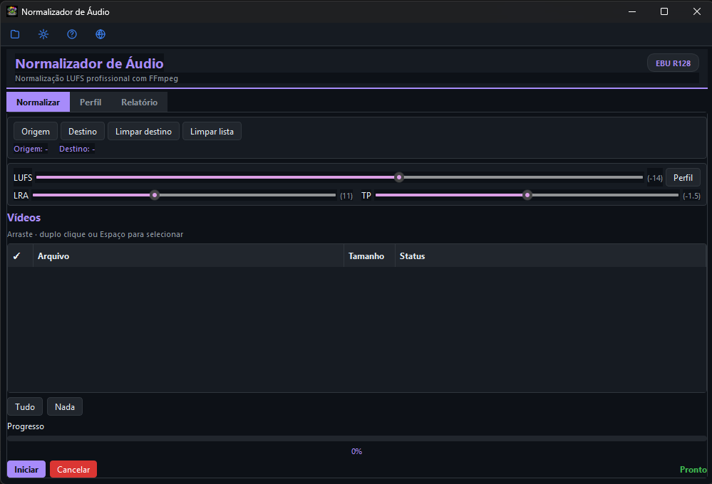
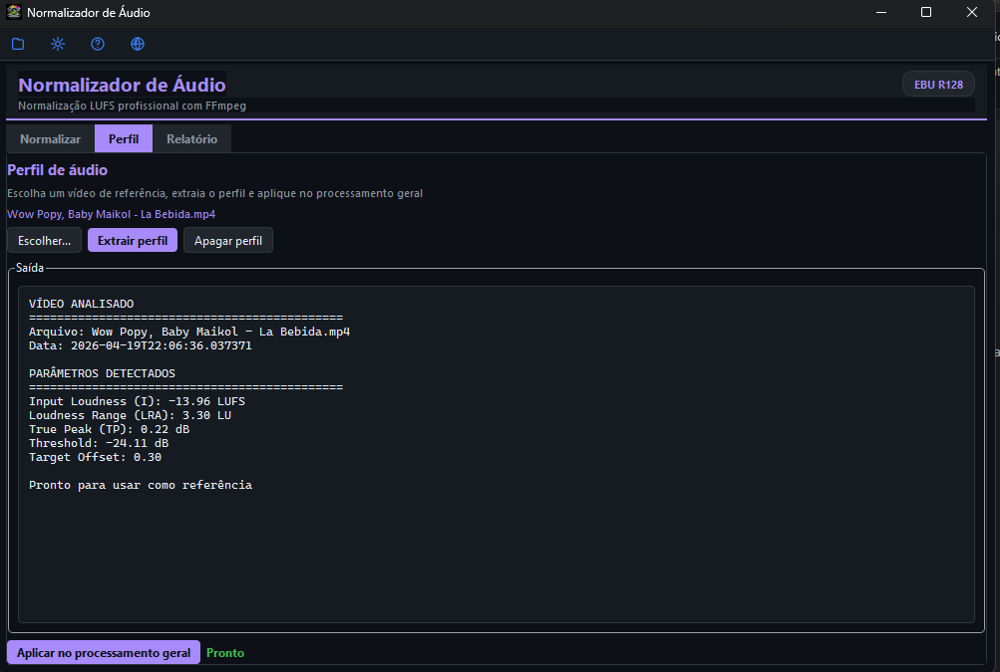
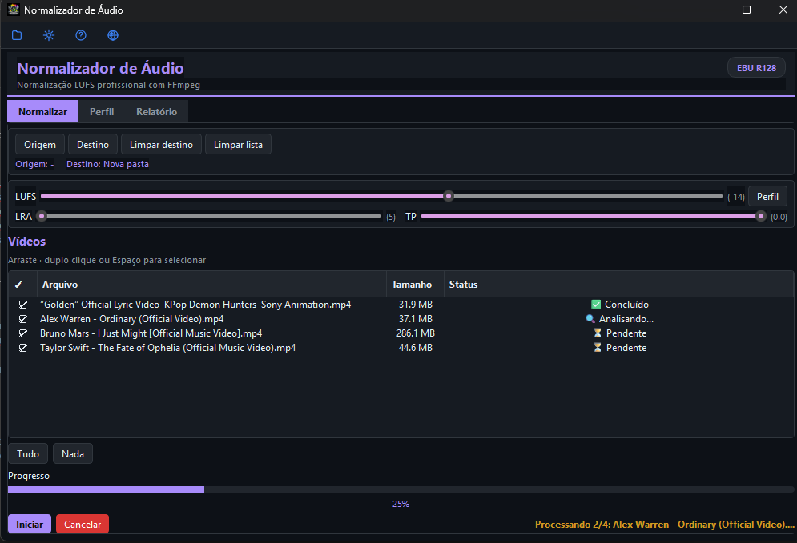

<div align="center">
  
  <h1>Normalizador Audio</h1>
  <p align="center">
    <a href="https://www.gnu.org/licenses/gpl-3.0"></a>
    <a href="https://www.python.org/downloads/release/python-3110/"></a>
    <a href="https://www.microsoft.com/windows"></a>
    <a href="https://github.com/wilkinbarban/normalizador-audio/releases"></a>
    <a href="#educational-disclaimer--aviso-educativo--aviso-educacional"></a>
  </p>
</div>

---

> ⚠️ EDUCATIONAL DISCLAIMER / AVISO EDUCATIVO / AVISO EDUCACIONAL
>
> This project is developed strictly for educational purposes to demonstrate desktop app development with Python + PyQt6, audio normalization workflows with FFmpeg, background workers, and multilingual UI design.
>
> El autor no promueve usos indebidos de herramientas multimedia ni el incumplimiento de términos de servicio de plataformas de terceros.
>
> O autor não incentiva uso indevido de ferramentas multimídia nem violação de termos de serviço de plataformas de terceiros.

---

[License: GPL v3](https://www.gnu.org/licenses/gpl-3.0) [Python](https://www.python.org/downloads/release/python-3110/) [Platform](https://www.microsoft.com/windows) [CI](https://github.com/wilkinbarban/normalizador-audio/actions) Educational


## Language / Idioma / Idioma

- [Español](#espanol)
- [English](#english)
- [Português (Brasil)](#portugues-brasil)

## Capturas de interfaz / Interface Screenshots / Capturas da interface

Vista principal de la aplicación · Main application view · Tela principal do aplicativo



Vista del perfil de audio · Audio profile view · Tela de perfil de audio



Vista de reportes y resumen · Reports and summary view · Tela de relatórios e resumo



## Español

### Descripción

Aplicación de escritorio para Windows desarrollada con Python y PyQt6 para normalizar audio en lotes de video usando FFmpeg y loudnorm (LUFS), con flujo de perfil de referencia, reportes y soporte multilenguaje.

### Características

- Normalización LUFS basada en FFmpeg loudnorm.
- Procesamiento por lotes de videos.
- Procesamiento paralelo configurable (workers simultáneos).
- Aceleración GPU opcional con detección automática y fallback a CPU.
- Perfil de referencia: analiza un video y aplica sus parámetros al lote.
- Waveform visual en la pestaña Perfil para previsualización de audio.
- Presets predefinidos: YouTube, Netflix, Spotify y Podcast (modo Custom incluido).
- Reporte antes/después (I, LRA, TP) con exportación CSV/TXT.
- Interfaz multilenguaje: Español, English, Português.
- Tema claro/oscuro y mensajes de estado en vivo.

### Requisitos

- Windows 10/11.
- Python compatible: >=3.8 y <3.14 (recomendado: 3.11).
- FFmpeg instalado y disponible en PATH.
- Conexión a Internet para instalación automática de dependencias.

### Método recomendado (prueba y ejecución rápida)

Para la forma más rápida de probar y ejecutar en Windows:

- Ejecuta `install_dependencies.bat` en la raíz del proyecto.

Este método ejecuta `install_dependencies.bat`, valida/instala Python y FFmpeg, instala dependencias desde `requirements.txt` y abre la aplicación.

### Instalación con un solo comando (PowerShell)

Opción A - Ya tienes el repositorio clonado o descargado:

```powershell
Set-ExecutionPolicy -Scope Process -ExecutionPolicy Bypass -Force; .\install.ps1
```

Opción A2 - No tienes el repositorio (bootstrap directo con install.ps1):

```powershell
Set-ExecutionPolicy -Scope Process -ExecutionPolicy Bypass -Force; irm https://raw.githubusercontent.com/wilkinbarban/normalizador-audio/main/install.ps1 | iex
```

Opción B - Instalación remota segura (sin clonar nada):

```powershell
Set-ExecutionPolicy -Scope Process -ExecutionPolicy Bypass -Force; irm https://raw.githubusercontent.com/wilkinbarban/normalizador-audio/main/install_secure.ps1 | iex
```

`install_secure.ps1` descarga el repositorio al Escritorio por defecto (`%USERPROFILE%\Desktop\normalizador-audio`), verifica el archivo descargado y delega en `install.ps1` localmente.

### Inicio rápido (alternativa clásica)

1. Clona o descarga el repositorio.
2. Ejecuta `install_dependencies.bat`.
3. El script instala dependencias y abre la app.

### Dependencia FFmpeg

El proyecto requiere FFmpeg disponible en PATH para análisis y normalización.
Si FFmpeg (o Python) no está instalado, `install_dependencies.bat` intenta instalarlo automáticamente y dejar el entorno listo para ejecutar la app.

## English

### Description

Windows desktop application built with Python and PyQt6 to normalize audio across video batches using FFmpeg loudnorm (LUFS), including a reference-profile workflow, reports, and multilingual UI.

### Features

- LUFS normalization powered by FFmpeg loudnorm.
- Batch video processing workflow.
- Configurable parallel processing (simultaneous workers).
- Optional GPU acceleration with automatic detection and CPU fallback.
- Reference profile: analyze one video and apply its parameters globally.
- Visual waveform preview in Profile tab.
- Built-in presets: YouTube, Netflix, Spotify and Podcast (with Custom mode).
- Before/after report (I, LRA, TP) with CSV/TXT export.
- Multilingual interface: Español, English, Português.
- Light/dark theme and live status messaging.

### Requirements

- Windows 10/11.
- Supported Python: >=3.8 and <3.14 (recommended: 3.11).
- FFmpeg installed and available in PATH.
- Internet connection for automatic dependency setup.

### Recommended method (quick test and run)

For the fastest way to run the app on Windows:

- Run `install_dependencies.bat` from the project root.

This method runs `install_dependencies.bat`, validates/installs Python and FFmpeg, installs dependencies from `requirements.txt`, and starts the app.

### One-command install (PowerShell)

Option A - You already have the repository cloned or downloaded:

```powershell
Set-ExecutionPolicy -Scope Process -ExecutionPolicy Bypass -Force; .\install.ps1
```

Option A2 - You do not have the repository yet (direct bootstrap with install.ps1):

```powershell
Set-ExecutionPolicy -Scope Process -ExecutionPolicy Bypass -Force; irm https://raw.githubusercontent.com/wilkinbarban/normalizador-audio/main/install.ps1 | iex
```

Option B - Secure remote install (no cloning required):

```powershell
Set-ExecutionPolicy -Scope Process -ExecutionPolicy Bypass -Force; irm https://raw.githubusercontent.com/wilkinbarban/normalizador-audio/main/install_secure.ps1 | iex
```

`install_secure.ps1` downloads the repository to Desktop by default (`%USERPROFILE%\Desktop\normalizador-audio`), verifies the archive, and then runs local `install.ps1`.

### Quick start (classic alternative)

1. Clone or download the repository.
2. Run `install_dependencies.bat`.
3. The script installs dependencies and launches the app.

### FFmpeg dependency

The project requires FFmpeg in PATH for analysis and normalization.
If FFmpeg (or Python) is missing, `install_dependencies.bat` attempts to install it automatically and prepare the environment to run the app.

## Português (Brasil)

### Descrição

Aplicativo desktop para Windows, desenvolvido com Python e PyQt6, para normalizar áudio em lotes de vídeo com FFmpeg loudnorm (LUFS), com fluxo de perfil de referência, relatórios e interface multilíngue.

### Recursos

- Normalização LUFS com FFmpeg loudnorm.
- Processamento em lote de vídeos.
- Processamento paralelo configurável (workers simultâneos).
- Aceleração GPU opcional com detecção automática e fallback para CPU.
- Perfil de referência: analisa um vídeo e aplica os parâmetros ao lote.
- Waveform visual na aba Perfil para pré-visualização de áudio.
- Presets integrados: YouTube, Netflix, Spotify e Podcast (modo Custom incluído).
- Relatório antes/depois (I, LRA, TP) com exportação CSV/TXT.
- Interface multilíngue: Español, English, Português.
- Tema claro/escuro e mensagens de status em tempo real.

### Requisitos

- Windows 10/11.
- Python suportado: >=3.8 e <3.14 (recomendado: 3.11).
- FFmpeg instalado e disponível no PATH.
- Conexão com a Internet para instalação automática de dependências.

### Método recomendado (teste e execução rápida)

Para a forma mais rápida de executar no Windows:

- Execute `install_dependencies.bat` na raiz do projeto.

Esse método executa `install_dependencies.bat`, valida/instala Python e FFmpeg, instala dependências do `requirements.txt` e inicia o aplicativo.

### Instalação com um único comando (PowerShell)

Opção A - Você já tem o repositório clonado ou baixado:

```powershell
Set-ExecutionPolicy -Scope Process -ExecutionPolicy Bypass -Force; .\install.ps1
```

Opção A2 - Você ainda não tem o repositório (bootstrap direto com install.ps1):

```powershell
Set-ExecutionPolicy -Scope Process -ExecutionPolicy Bypass -Force; irm https://raw.githubusercontent.com/wilkinbarban/normalizador-audio/main/install.ps1 | iex
```

Opção B - Instalação remota segura (sem clonar):

```powershell
Set-ExecutionPolicy -Scope Process -ExecutionPolicy Bypass -Force; irm https://raw.githubusercontent.com/wilkinbarban/normalizador-audio/main/install_secure.ps1 | iex
```

`install_secure.ps1` baixa o repositório para a Área de Trabalho por padrão (`%USERPROFILE%\Desktop\normalizador-audio`), valida o arquivo e delega para o `install.ps1` local.

### Início rápido (alternativa clássica)

1. Clone ou baixe o repositório.
2. Execute `install_dependencies.bat`.
3. O script instala dependências e inicia o app.

### Dependência FFmpeg

O projeto exige FFmpeg no PATH para análise e normalização.
Se FFmpeg (ou Python) estiver ausente, `install_dependencies.bat` tenta instalar automaticamente e preparar o ambiente para executar o aplicativo.

## Project structure

| Path | Description |
| --- | --- |
| normalizador.py | Main launcher entry point |
| install_dependencies.bat | Dependency installer (Python, FFmpeg, requirements) |
| install.ps1 | One-command installer and launcher (PowerShell) |
| install_secure.ps1 | Secure remote installer: download, verify, delegate |
| requirements.txt | Python dependencies |
| normalizador_config.ini | User settings file |
| normalizador_app/main.py | Application bootstrap |
| normalizador_app/core/ | Core config, constants, i18n and logging |
| normalizador_app/services/ | Audio, dependency and report services |
| normalizador_app/ui/ | Main window, styles, widgets, controllers, dialogs |
| normalizador_app/workers/ | Background workers for processing and analysis |
| normalizador_app/assets/ | Icons and screenshots |
| tests/ | Automated test suite |
| .github/workflows/ | CI pipelines (tests, syntax, quality) |

## Educational Disclaimer / Aviso Educativo / Aviso Educacional

This software is provided for educational purposes only. It demonstrates:

- PyQt6 desktop architecture
- Audio normalization with FFmpeg loudnorm
- Worker-based background processing
- Reporting and export workflows
- Runtime multilingual interface (ES/EN/PT)
- Automated dependency setup on Windows

The author (wilkinbarban) is not responsible for misuse by third parties.

## License

This project is licensed under the GNU General Public License v3.0.

You are free to run, study, share, and modify this software under GPL-3.0 terms. Any derivative work must also be distributed under GPL-compatible conditions with source code available.

See [LICENSE](LICENSE) for the full license text.

```text
Normalizador Audio  Copyright (C) 2026  wilkinbarban
This program comes with ABSOLUTELY NO WARRANTY.
This is free software, and you are welcome to redistribute it
under certain conditions; see LICENSE for details.
```

## Additional Links

- [Code](https://github.com/wilkinbarban/normalizador-audio)
- [Issues](https://github.com/wilkinbarban/normalizador-audio/issues)
- [Pull requests](https://github.com/wilkinbarban/normalizador-audio/pulls)
- [Actions](https://github.com/wilkinbarban/normalizador-audio/actions)
- [Security](https://github.com/wilkinbarban/normalizador-audio/security)
