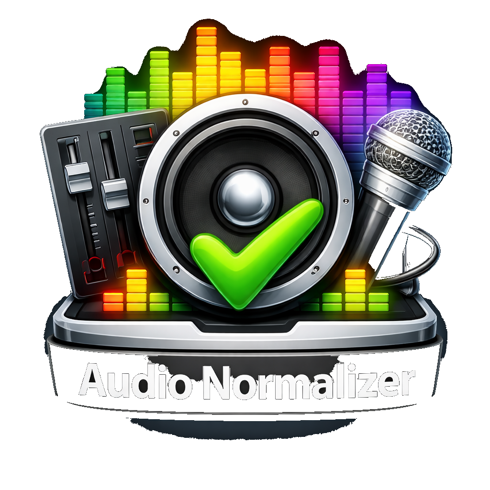
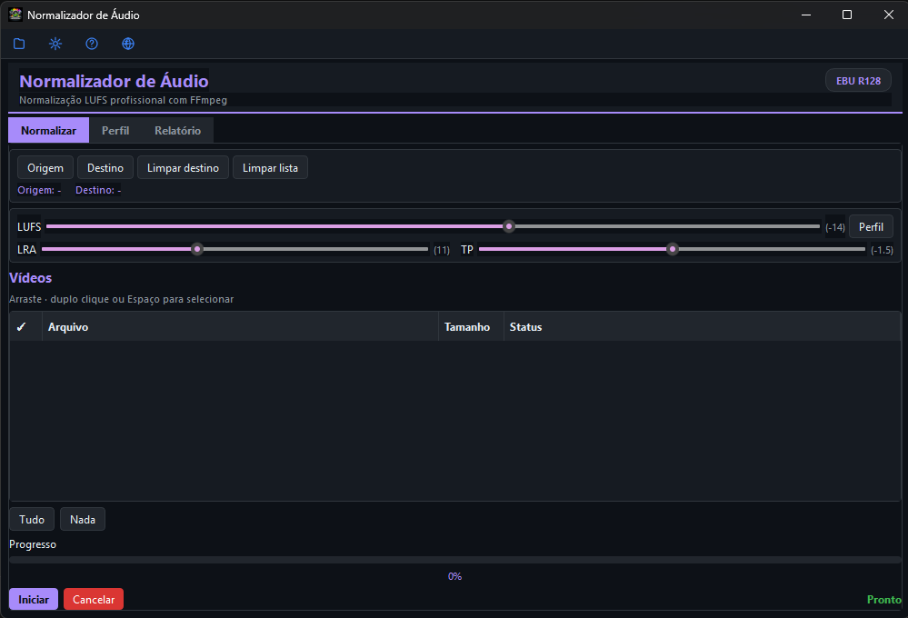
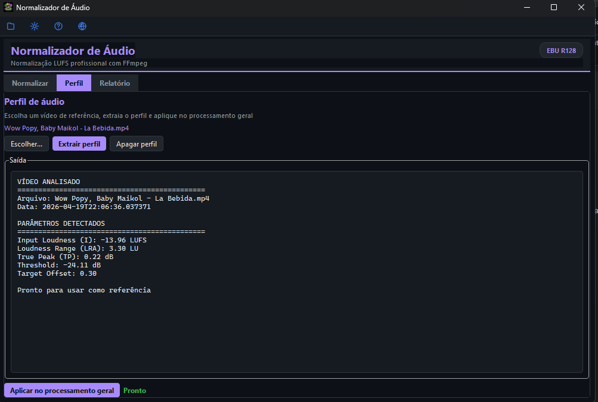
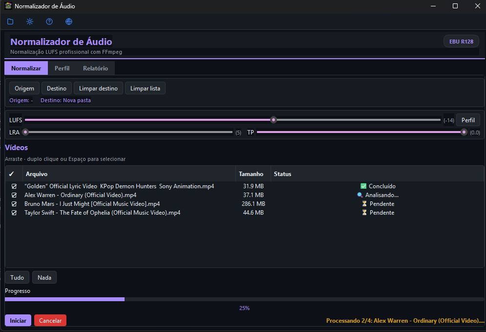

<div align="center">
  
  <h1>Normalizador Audio</h1>
  <p>
    <a href="https://www.gnu.org/licenses/gpl-3.0"></a>
    <a href="https://www.python.org/downloads/"></a>
    <a href="https://www.microsoft.com/windows"></a>
    <a href="https://github.com/wilkinbarban/normalizador-audio/releases"></a>
    <a href="https://github.com/wilkinbarban/normalizador-audio/actions"></a>
  </p>
</div>

---

> **Educational Disclaimer / Aviso educativo / Aviso educacional**
>
> This project is developed strictly for educational purposes. It demonstrates Python + PyQt6 desktop development, FFmpeg loudness normalization, background workers, reporting workflows, multilingual UI design, and automated Windows dependency setup.
>
> Este proyecto se desarrolla estrictamente con fines educativos. El autor no promueve usos indebidos de herramientas multimedia ni el incumplimiento de términos de servicio de plataformas de terceros.
>
> Este projeto é desenvolvido estritamente para fins educacionais. O autor não incentiva o uso indevido de ferramentas multimídia nem a violação de termos de serviço de plataformas de terceiros.

---

## Language / Idioma / Idioma

- [Español](#español)
- [English](#english)
- [Português (Brasil)](#português-brasil)

---

## Capturas de interfaz / Interface screenshots / Capturas da interface

Vista principal de la aplicación · Main application view · Tela principal do aplicativo



Vista del perfil de audio · Audio profile view · Tela de perfil de áudio



Vista de reportes · Reports view · Tela de relatórios



---

## Español

### Descripción

Normalizador Audio es una aplicación de escritorio para Windows que normaliza el volumen de lotes de video con FFmpeg `loudnorm` (LUFS). Está pensada para preparar contenido con niveles de escucha consistentes, trazabilidad de resultados y una interfaz clara para trabajos repetitivos.

La aplicación permite analizar archivos, aplicar perfiles de normalización, revisar el estado de cada video y generar reportes con métricas antes/después. Su instalador oficial es un único flujo de PowerShell basado en `install.ps1`; no hay un segundo método de instalación con un clic.

### Características

- Normalización LUFS basada en FFmpeg.
- Procesamiento por lotes con tabla de estado por archivo.
- Presets para YouTube, Netflix, Spotify, Podcast y modo Custom.
- Perfil de referencia para extraer parámetros de un video modelo y aplicarlos al lote.
- Previsualización visual de waveform en la pestaña Perfil.
- Reportes CSV/TXT con métricas antes/después.
- Procesamiento paralelo configurable.
- Aceleración GPU opcional, con fallback a CPU cuando corresponde.
- Tema claro/oscuro e interfaz en Español, English y Português (Brasil).
- Configuración, perfil de audio y logs fuera del repositorio, en la carpeta local del usuario.

### Requisitos

- Windows 10/11.
- PowerShell 5.1 o superior.
- Conexión a Internet para descargar el repositorio e instalar dependencias.
- `winget` recomendado para instalar Python y FFmpeg automáticamente cuando falten.
- FFmpeg disponible en `PATH`; el instalador intenta resolverlo con `winget` si no lo detecta.

El instalador detecta la versión `major.minor` de Python disponible en el sistema y la usa como piso local de compatibilidad. Por ejemplo, si detecta Python 3.14, el entorno local queda tratado como Python `>=3.14`. Si Python no está instalado y `winget` está disponible, el instalador intenta instalar Python automáticamente.

### Instalación con un clic en PowerShell

Para instalar y ejecutar la aplicación sin clonar ni descargar manualmente el repositorio, abre PowerShell y ejecuta este único comando:

```powershell
Set-ExecutionPolicy -Scope Process -ExecutionPolicy Bypass -Force; irm https://raw.githubusercontent.com/wilkinbarban/normalizador-audio/main/install.ps1 | iex
```

> **¿Cómo funciona?** El instalador `install.ps1` comprueba si los archivos del proyecto ya están presentes en la carpeta actual. Si no los encuentra, descarga el repositorio desde GitHub mediante HTTPS, valida que el archivo descargado tenga contenido, lo extrae por defecto en `%USERPROFILE%\Desktop\normalizador-audio`, crea o reutiliza el entorno virtual `.venv`, instala las dependencias de `requirements.txt`, comprueba Python y FFmpeg, y finalmente lanza la aplicación.

Para cambiar la carpeta de instalación antes de ejecutar el comando principal:

```powershell
$env:NORM_INSTALL_DIR = "D:\Apps\normalizador-audio"
```

### Dependencias del programa

El flujo de instalación con `install.ps1` gestiona las dependencias necesarias para ejecutar la aplicación:

- **Python:** se detecta desde el sistema; si falta y `winget` está disponible, se intenta instalar automáticamente.
- **FFmpeg:** se valida en `PATH`; si falta y `winget` está disponible, se intenta instalar automáticamente.
- **Paquetes Python:** se instalan en `.venv` desde `requirements.txt`: PyQt6, requests, packaging, qrcode/Pillow, pytest, pytest-cov, bandit y pylint.

Los archivos de usuario no se guardan dentro del repositorio. Configuración, perfil de audio y logs se almacenan en:

```text
%LOCALAPPDATA%\NormalizadorAudio\
```

### Uso básico

1. Ejecuta el comando de instalación en PowerShell.
2. Agrega los videos que deseas normalizar.
3. Selecciona un preset o genera un perfil de referencia.
4. Define la carpeta de salida y ejecuta el proceso.
5. Revisa los reportes generados para confirmar las métricas de normalización.

---

## English

### Description

Normalizador Audio is a Windows desktop application that normalizes loudness across video batches with FFmpeg `loudnorm` (LUFS). It is designed for preparing content with consistent listening levels, traceable results, and a focused interface for repetitive production work.

The app lets you analyze files, apply normalization profiles, review the status of each video, and generate before/after reports. Its official installer is a single PowerShell flow based on `install.ps1`; there is no second one-click installation method.

### Features

- FFmpeg-powered LUFS normalization.
- Batch processing with a per-file status table.
- YouTube, Netflix, Spotify, Podcast, and Custom presets.
- Reference profile workflow for extracting settings from a model video and applying them to a batch.
- Visual waveform preview in the Profile tab.
- CSV/TXT reports with before/after metrics.
- Configurable parallel processing.
- Optional GPU acceleration, with CPU fallback when needed.
- Light/dark themes and Spanish, English, and Brazilian Portuguese support.
- Configuration, audio profile, and logs stored outside the repository in the user's local data folder.

### Requirements

- Windows 10/11.
- PowerShell 5.1 or newer.
- Internet access to download the repository and install dependencies.
- `winget` recommended for automatic Python and FFmpeg installation when they are missing.
- FFmpeg available in `PATH`; the installer attempts to resolve it with `winget` when it is not detected.

The installer detects the available Python `major.minor` version and uses it as the local compatibility floor. For example, Python 3.14 detected means the local environment is treated as Python `>=3.14`. If Python is not installed and `winget` is available, the installer attempts to install Python automatically.

### One-click PowerShell installation

To install and run the application without manually cloning or downloading the repository, open PowerShell and run this single command:

```powershell
Set-ExecutionPolicy -Scope Process -ExecutionPolicy Bypass -Force; irm https://raw.githubusercontent.com/wilkinbarban/normalizador-audio/main/install.ps1 | iex
```

> **How does it work?** The `install.ps1` installer checks whether the project files already exist in the current folder. If they are missing, it downloads the repository from GitHub over HTTPS, verifies that the downloaded archive contains data, extracts it by default to `%USERPROFILE%\Desktop\normalizador-audio`, creates or reuses the `.venv` virtual environment, installs dependencies from `requirements.txt`, checks Python and FFmpeg, and finally launches the application.

To change the install folder before running the main command:

```powershell
$env:NORM_INSTALL_DIR = "D:\Apps\normalizador-audio"
```

### Program dependencies

The `install.ps1` flow manages the dependencies required to run the application:

- **Python:** detected from the system; if missing and `winget` is available, automatic installation is attempted.
- **FFmpeg:** validated in `PATH`; if missing and `winget` is available, automatic installation is attempted.
- **Python packages:** installed into `.venv` from `requirements.txt`: PyQt6, requests, packaging, qrcode/Pillow, pytest, pytest-cov, bandit, and pylint.

User files are not stored inside the repository. Configuration, audio profile, and logs are stored in:

```text
%LOCALAPPDATA%\NormalizadorAudio\
```

### Basic usage

1. Run the PowerShell installation command.
2. Add the videos you want to normalize.
3. Select a preset or generate a reference profile.
4. Choose the output folder and start processing.
5. Review the generated reports to confirm normalization metrics.

---

## Português (Brasil)

### Descrição

Normalizador Audio é um aplicativo desktop para Windows que normaliza o volume de lotes de vídeo com FFmpeg `loudnorm` (LUFS). Ele foi pensado para preparar conteúdo com níveis de escuta consistentes, resultados rastreáveis e uma interface objetiva para trabalhos repetitivos.

O aplicativo permite analisar arquivos, aplicar perfis de normalização, revisar o estado de cada vídeo e gerar relatórios com métricas antes/depois. O instalador oficial é um único fluxo de PowerShell baseado em `install.ps1`; não há um segundo método de instalação com um clique.

### Recursos

- Normalização LUFS baseada em FFmpeg.
- Processamento em lote com tabela de status por arquivo.
- Presets para YouTube, Netflix, Spotify, Podcast e modo Custom.
- Fluxo de perfil de referência para extrair parâmetros de um vídeo modelo e aplicá-los ao lote.
- Pré-visualização visual de waveform na aba Perfil.
- Relatórios CSV/TXT com métricas antes/depois.
- Processamento paralelo configurável.
- Aceleração por GPU opcional, com fallback para CPU quando necessário.
- Temas claro/escuro e suporte a Espanhol, Inglês e Português (Brasil).
- Configuração, perfil de áudio e logs fora do repositório, na pasta local do usuário.

### Requisitos

- Windows 10/11.
- PowerShell 5.1 ou superior.
- Internet para baixar o repositório e instalar dependências.
- `winget` recomendado para instalar Python e FFmpeg automaticamente quando estiverem ausentes.
- FFmpeg disponível no `PATH`; o instalador tenta resolver isso com `winget` quando não o detecta.

O instalador detecta a versão `major.minor` de Python disponível no sistema e usa essa versão como piso local de compatibilidade. Por exemplo, Python 3.14 detectado significa ambiente local tratado como Python `>=3.14`. Se Python não estiver instalado e `winget` estiver disponível, o instalador tentará instalar Python automaticamente.

### Instalação com um clique no PowerShell

Para instalar e executar o aplicativo sem clonar nem baixar manualmente o repositório, abra o PowerShell e execute este único comando:

```powershell
Set-ExecutionPolicy -Scope Process -ExecutionPolicy Bypass -Force; irm https://raw.githubusercontent.com/wilkinbarban/normalizador-audio/main/install.ps1 | iex
```

> **Como funciona?** O instalador `install.ps1` verifica se os arquivos do projeto já estão presentes na pasta atual. Se não estiverem, baixa o repositório do GitHub via HTTPS, valida que o arquivo baixado contém dados, extrai por padrão em `%USERPROFILE%\Desktop\normalizador-audio`, cria ou reutiliza o ambiente virtual `.venv`, instala as dependências de `requirements.txt`, verifica Python e FFmpeg, e finalmente inicia o aplicativo.

Para alterar a pasta de instalação antes de executar o comando principal:

```powershell
$env:NORM_INSTALL_DIR = "D:\Apps\normalizador-audio"
```

### Dependências do programa

O fluxo de instalação com `install.ps1` gerencia as dependências necessárias para executar o aplicativo:

- **Python:** detectado no sistema; se estiver ausente e `winget` estiver disponível, a instalação automática será tentada.
- **FFmpeg:** validado no `PATH`; se estiver ausente e `winget` estiver disponível, a instalação automática será tentada.
- **Pacotes Python:** instalados em `.venv` a partir de `requirements.txt`: PyQt6, requests, packaging, qrcode/Pillow, pytest, pytest-cov, bandit e pylint.

Os arquivos do usuário não ficam dentro do repositório. Configuração, perfil de áudio e logs são armazenados em:

```text
%LOCALAPPDATA%\NormalizadorAudio\
```

### Uso básico

1. Execute o comando de instalação no PowerShell.
2. Adicione os vídeos que deseja normalizar.
3. Selecione um preset ou gere um perfil de referência.
4. Defina a pasta de saída e inicie o processamento.
5. Revise os relatórios gerados para confirmar as métricas de normalização.

---

## Project structure

| Path | Description |
| --- | --- |
| `normalizador.py` | Application entry point. |
| `install.ps1` | Single PowerShell installer, remote bootstrapper, dependency setup, and launcher. |
| `requirements.txt` | Python dependencies and runtime policy note. |
| `normalizador_app/main.py` | Application bootstrap. |
| `normalizador_app/core/` | Configuration, constants, i18n, paths, and logging. |
| `normalizador_app/services/` | Audio, dependency, update, GPU, waveform, and report services. |
| `normalizador_app/ui/` | Main window, styles, widgets, controllers, and dialogs. |
| `normalizador_app/workers/` | Background workers for processing and analysis. |
| `normalizador_app/assets/` | Icons and screenshots. |
| `tests/` | Automated test suite. |
| `.github/workflows/` | CI and release pipelines. |

## Troubleshooting

- **Python is installed but not detected:** close the terminal, open a new PowerShell window, and run the install command again.
- **FFmpeg is installed but not detected:** close the terminal so PATH updates are visible, then rerun the install command.
- **Dependency installation failed:** inspect `.venv\install.log`, then try `.venv\Scripts\pip.exe install -r requirements.txt`.
- **The app exits with an error:** check the console output and `%LOCALAPPDATA%\NormalizadorAudio\normalizador_errors.log`.
- **The installer uses the wrong folder:** set `$env:NORM_INSTALL_DIR` before running the install command.

## License

This project is licensed under the GNU General Public License v3.0. You are free to run, study, share, and modify this software under the GPL-3.0 terms. See [LICENSE](LICENSE) for the full license text.

```text
Normalizador Audio  Copyright (C) 2026  wilkinbarban
This program comes with ABSOLUTELY NO WARRANTY.
This is free software, and you are welcome to redistribute it
under certain conditions; see LICENSE for details.
```

## Links

- [Code](https://github.com/wilkinbarban/normalizador-audio)
- [Releases](https://github.com/wilkinbarban/normalizador-audio/releases)
- [Issues](https://github.com/wilkinbarban/normalizador-audio/issues)
- [Pull requests](https://github.com/wilkinbarban/normalizador-audio/pulls)
- [Actions](https://github.com/wilkinbarban/normalizador-audio/actions)
- [Security](https://github.com/wilkinbarban/normalizador-audio/security)
